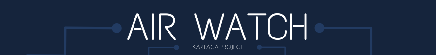

<p align="center">
  
</p>

## AirWatch - Air Quality Monitoring System

AirWatch is a microservice-based system designed to collect, analyze, and detect anomalies in air quality data. This system monitors air quality data from various locations, detects anomalies, and sends notifications when necessary.

### System Architecture

AirWatch consists of the following microservices:

1. **API Gateway**: Entry point for all client requests, routes requests to appropriate services.
2. **Air Quality Service**: Collects and provides air quality data.
3. **Anomaly Detection Service**: Analyzes air quality data to detect anomalies.
4. **Notification Service**: Creates and manages notifications for detected anomalies.

### Technology Stack

- **Spring Boot**: For microservice development
- **Spring Cloud Gateway**: For API Gateway
- **Kafka**: For asynchronous communication between microservices
- **TimescaleDB**: For storing time-series data
- **Swagger/OpenAPI**: For API documentation
- **Docker**: For containerization
- **React**: For frontend application
- **Vite**: For frontend build tooling
- **Leaflet**: For interactive maps
- **Recharts**: For data visualization

### Getting Started

#### Prerequisites

- Java 17 or higher
- Maven
- Node.js and npm (for frontend development)
- Docker and Docker Compose
- Git

### Installation

1. Clone the repository:
   ```bash
   git clone https://github.com/yourusername/AirWatch.git
   cd AirWatch
   ```

2. Build all microservices:
   ```bash
   # On Windows (PowerShell)
   .\build-services.bat

   # On Windows (Command Prompt)
   build-services.bat

   # On Linux/Mac
   chmod +x build-services.sh
   ./build-services.sh
   ```

3. Build the frontend (optional, if you want to run it locally):
   ```bash
   cd frontend
   npm install
   npm run build
   cd ..
   ```

4. Start all services with Docker Compose:
   ```bash
   docker-compose up -d
   ```

5. Check if all services are running:
   ```bash
   docker-compose ps
   ```

   > **Note**: When Docker Compose starts, it automatically initializes the TimescaleDB database with dummy data for cities using the `init.sql` script.

### API Access

After the system is started, you can access the APIs via the following URLs:

- **API Gateway**: http://localhost:8484
- **Swagger UI**: http://localhost:8484/swagger-ui.html
- **Frontend** (if running locally): http://localhost:5173 (using `npm run dev` in the frontend directory)

## Frontend Application

The AirWatch system includes a React-based frontend application that provides a visual interface for monitoring air quality data:

- **Interactive Map**: Displays pollution levels across different cities with color-coded indicators
- **Pollution Charts**: Shows trends and current levels of various pollutants
- **Anomaly Warnings**: Highlights detected anomalies and potential health risks
- **City Details**: Provides detailed pollution information for selected cities

To run the frontend locally (for development):

```bash
cd frontend
npm install
npm run dev
```

The frontend will be available at http://localhost:5173 and will automatically connect to the backend services through the API Gateway.

## API Endpoints

### Air Quality Service

- `GET /api/air-quality?location={location}`: Retrieves air quality data for a specific location.
- `GET /api/pollution-density`: Retrieves pollution density data by geographical regions.
- `GET /api/air-quality/locations`: Retrieves a list of all available city locations.

### Anomaly Detection Service

- `GET /api/anomalies?startTime={startTime}&endTime={endTime}`: Lists anomalies detected within a specific time range.

### Notification Service

- `GET /api/notifications`: Lists all notifications.
- `GET /api/notifications/{id}`: Retrieves details of a specific notification.

## Data Flow

1. Air Quality Service collects air quality data and stores it in TimescaleDB.
2. Air Quality Service sends raw data to Kafka.
3. Anomaly Detection Service consumes data from Kafka, analyzes it, and detects anomalies.
4. Detected anomalies are stored by the Anomaly Detection Service and sent to Kafka.
5. Notification Service consumes anomaly notifications from Kafka and processes them.
6. Frontend application fetches data from the API Gateway and displays it on an interactive map and charts.

## Database Initialization

When the system starts up with Docker Compose, the TimescaleDB database is automatically initialized with the following:

1. **TimescaleDB Extension**: The TimescaleDB extension is enabled for time-series data handling
2. **Tables Creation**: Tables for air quality data, anomalies, and notifications are created
3. **Hypertables**: The tables are converted to TimescaleDB hypertables for efficient time-series operations
4. **Dummy Data**: Initial air quality data for various cities is inserted

This initialization is handled by the `init.sql` script that is mounted as a volume in the TimescaleDB container.

## Development

### Adding a New Microservice

1. Create a new Maven module:
   ```bash
   mvn archetype:generate -DgroupId=org.airwatch -DartifactId=new-service -DarchetypeArtifactId=maven-archetype-quickstart -DinteractiveMode=false
   ```

2. Add the new module to the parent POM:
   ```xml
   <modules>
       <!-- Existing modules -->
       <module>new-service</module>
   </modules>
   ```

3. Create Spring Boot configuration for the new service.

4. Add routing rules for the new service in the API Gateway.

### Code Style

This project follows the Google Java Style Guide. To check the code style:

```bash
mvn checkstyle:check
```

## Troubleshooting

### Kafka Connection Issues

If you encounter the "Connection to node -1 could not be established" error:

1. Make sure Kafka is running:
   ```bash
   docker ps | grep kafka
   ```

2. Check the Kafka configuration:
   ```properties
   spring.kafka.bootstrap-servers=kafka:29092
   ```

### TimescaleDB Connection Issues

For TimescaleDB connection issues:

1. Make sure TimescaleDB is running:
   ```bash
   docker ps | grep timescaledb
   ```

2. Check the TimescaleDB configuration:
   ```properties
   spring.datasource.url=jdbc:postgresql://timescaledb:5432/airwatch
   spring.datasource.username=postgres
   spring.datasource.password=postgres
   spring.datasource.driver-class-name=org.postgresql.Driver
   ```

3. If you encounter authentication issues, check the `pg_hba.conf` file and make sure the trust authentication method is properly configured.

## Contributing

1. Fork this repository
2. Create a feature branch (`git checkout -b feature/amazing-feature`)
3. Commit your changes (`git commit -m 'Add some amazing feature'`)
4. Push your branch (`git push origin feature/amazing-feature`)
5. Open a Pull Request

## License

This project is licensed under the MIT License - see the [LICENSE](LICENSE) file for details.
